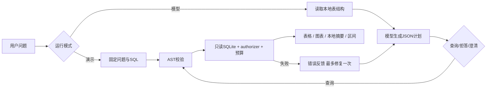

# 架构与取舍

## 数据层

只有一张 `bank_contacts`，粒度就是源观察记录。没有为演示 JOIN 而伪造 customers/orders 表。原始数据有 21 列，系统添加 `observation_id` 和 `subscribed`，得到 23 列。SQLite 适合 4 万条历史记录的本地教学；PostgreSQL 的多用户权限和并发在这个规模没有必要。

下载压缩包时设置大小上限；按已知文件名读取嵌套 ZIP，不调用任意路径解压。数据校验行数和订阅总数后进入临时数据库，再替换正式库，避免半写入。SHA-256 用于追溯；记录哈希不是远端真实性证明。

## 为什么是一个有限流程 Agent

这里的 Agent 范围是“为问题生成计划、调用受限数据库执行能力、利用错误反馈重试”，并非无限循环、自主部署或任意 Python 执行。单表任务可直接传已检查的 schema；没有必要把单表系统包装成动态检索多表 Agent。一次修复让错误可恢复，又限制成本和复杂度。

演示模式直接选择固定 SQL；模型模式使用真实 Responses API，输出 JSON 计划。无效 JSON、无效 SQL 都最多再试一次。HTTP/认证错误直接返回失败，界面不会偷偷改成演示结果。

## SQL 安全边界

1. sqlglot 解析：只接受一个 SELECT，可使用非递归 CTE；限定表名，拒绝 DDL/DML、PRAGMA、ATTACH、跨库读取等。
2. SQLite URI `mode=ro` 加 `query_only`：数据库本身拒绝写入。
3. SQLite authorizer：只允许 bank_contacts、SELECT 和已知聚合/窗口等函数，防止扩展加载或文件读取函数。
4. progress handler：每 1,000 条 VM 指令检查，默认最多 2,000,000 条或 3 秒，限制大笛卡尔积。
5. fetchmany：默认最多返回 200 行，同时标记截断。

这不是通用不可信代码沙箱，也不承诺严格进程级内存隔离。应用不执行模型生成的 Python。SQL 能执行不表示业务语义正确，例如模型仍可能选错分母；需要独立评测与人工复核。

## 摘要与统计

摘要直接读取实际结果列，不让第二次 LLM 生成未经验证的数值。若有 conversion_pct，会说明“已返回结果中最高的分组”，避免 LIMIT 后误称全局最优。Wilson 区间用 Python 计算，帮助观察样本规模影响；它假设独立观察，无法处理数据中潜在的同客重复，也不调整混杂或多重比较。

## 可观测性和评测

每次返回 mode、status、SQL、表格、步骤、耗时；模型模式还记录 token usage。日志只记录异常类型，不把供应商错误正文/密钥泄露到界面。导出的 JSON 是复现材料。

单元测试用小型独立数据库测执行安全与重试；集成测试用真实数据操作 Streamlit；评测从 CSV 用 Python 直接计算参考值。演示评测与真实模型评测分别保存，不能合并宣传。

## 下一步怎样扩展

多表真实数据才需要 schema 检索和 JOIN 基准；更多用户才需要认证、服务端预算和 PostgreSQL；有真实模型评测后再决定是否需要结构化输出约束、更复杂规划或语义检查。现阶段关键不足是未做真实模型评测，且业务语义防线主要靠提示和评测。
